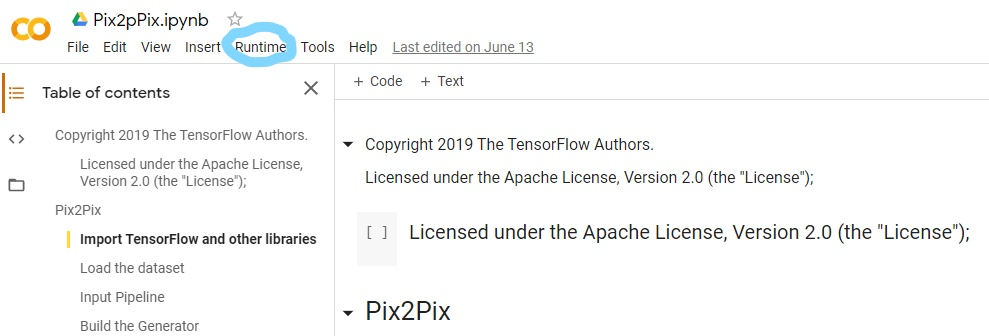
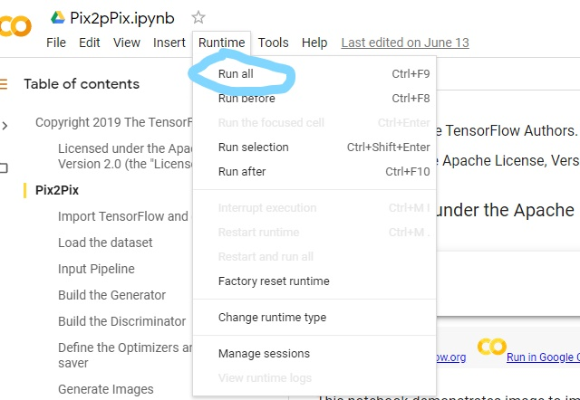

# Skin Cancer Detection With Pix2PixGan

## Table of contents
* [Resources](#resources)
* [Technologies](#technologies)
* [Running Pix2Pix](#running-pix2pix)

## Resources
Pix2PixData: https://drive.google.com/file/d/1nukfGbIpiJ_54EQN2SgwQ8rjr_91tpxY/view?ts=5ee3038a
GoogleCollab: https://colab.research.google.com/drive/1owuePH1cfXwokWWg8SPcC0-d_Piw1_na?ts=5ee302d7
	
## Technologies
* Google Collab

## Running Pix2Pix
To run this project, you must have a google drive.

Before you start running the notebook you need to take the Pix2Pixdata and put it in your google drive. 
```diff 
- Do not put the Pix2Pixdata in any folder
```
Go to the google collab ipynb in resources



* In the top left corner toolbar, click runtime



* Click on Run all to start the training

```diff 
! For the average computer it usually takes 2+ hours to complete the training
!  You might have to put a authorization code
```


